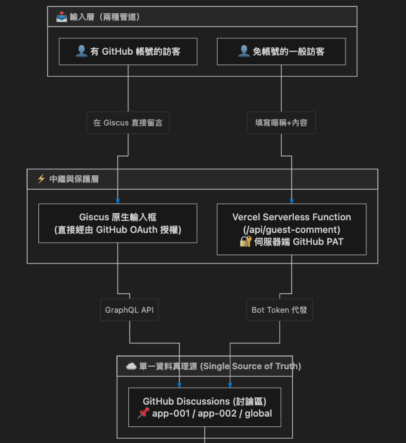

# 001-Challenge Showcase

用來展示 100 Apps Challenge 的總入口網站與展示中心。此專案記錄創作者的創作軌跡，提供探索與互動展示空間，藉此調查哪些產品受到喜愛且具備潛在市場需求，並提供聯絡方式促進進一步交流與合作。

---

## 🛠️ 技術路線
- **前端框架**：React 19 + TypeScript
- **建置工具**：Vite 8
- **樣式庫**：Tailwind CSS v4
- **圖示庫**：Lucide React
- **動效與反饋**：Canvas Confetti (點擊愛心/互動慶祝微動效)
- **Markdown 渲染**：`marked` 是用來將 Markdown 語法字串解析並轉換為 HTML 的套件
- **留言板**：Giscus 串接 GitHub discussions
- **資料庫**：Supabase 的 Serveless database 服務
- **前端託管**：GitHub 版本控制，搭配 Vercel 自動部署
- **後端邏輯**：Vercel Edge Functions
- **依賴管理**：採用 **pnpm** 作為統一依賴套件管理工具。全域硬連結儲存庫可大幅節省磁碟空間，並防止幽靈依賴
---

## 🚀 安裝與啟動說明

```bash
# 進入子專案目錄
cd "apps/001-Challenge Showcase"

# 安裝依賴
pnpm install

# 啟動本地開發伺服器
pnpm dev

# 建置生產版本
pnpm build

# 本地預覽生產版本
pnpm preview
```

---

## 💡 使用說明
1. **作品探索卡片 (App Card)**：自動展示各 App 編號、名稱、開發狀態徽章、分類標籤、簡介。
2. **即時文件預覽 (Doc Viewer)**：點擊「查看文件」可直接以彈窗形式閱讀該 App 的 `README.md` 工程說明。
3. **即時搜尋與多維篩選**：支援關鍵字搜尋、依開發狀態（進行中 / 已完成）過濾、依技術 Tag 標籤過濾。
4. **互動與市場需求驗證 (Engagement Hub)**：
   - **愛心按讚 (Likes)**：點擊作品愛心給予好評，即時統計喜愛數，評估產品潛力。
   - **瀏覽計數 (Views)**：統計每個作品的造訪熱度。
   - **交流與聯絡 (Contact)**：一鍵複製 Email 帳號、前往 GitHub 個人主頁。
   - **留言與許願板 (Feedback & Wishlist)**：供訪客留言交流、提供建議或許願新功能。

---

## 架構

### Giscus 留言板

1. 有 GitHub：適合開發者與技術社群，直接享有 GitHub 原生的個人頭像、Markdown 完整渲染、Emoji 表情反饋（Reactions）與通知通知機制。
2. 免登入訪客：提供極簡輸入表單（暱稱、內容）。透過 Vercel Serveless Fuction 中繼轉發。

不管用哪種方式留言，最終儲存點都是同一篇 GitHub Discussion。

### Data-Driven 設計
資料驅動 (Data-Driven)，透過 Vite 編譯期動態掃描所有子 App 之 `app-manifest.json` 與 `README.md`，無須手動硬編碼清單。

### 即時 Markdown 渲染

在我們目前的專案中，使用邏輯是用戶點選「查看文件」按鈕後展開 `README.md`，所以設計上是在「客戶端」進行及時渲染！

運作流程：

1. **打包階段（Vite Build）**：
   - 我們的 `import.meta.glob` 以字串方式讀取各 App 的 `README.md`（原始純文字格式）。
2. **傳遞給瀏覽器**：
   - 當訪客打開 Showcase 網站，點擊某個 App 卡片的「查看文件」時，React 收到的是 Markdown 純文字。
3. **在訪客的瀏覽器內部即時渲染（Client-side）**：
   - 請看 `DocViewerModal.tsx`(apps/001-Challenge-Showcase/src/components/DocViewerModal.tsx#L27-L34) 的這段程式碼：
     ```tsx
     const parsedHtml = useMemo(() => {
       return marked.parse(markdownContent, { async: false }) as string;
     }, [markdownContent]);
     ```

使用者點開彈窗的瞬間，瀏覽器內的 JavaScript 呼叫 `marked.parse` 把 Markdown 轉成 HTML，接著渲染在彈窗畫面上。

好處：
- 打包後的 JSON/Markdown 檔案體積小，只有在使用者真正點擊「查看文件」時，才在瀏覽器中花費不到 1 毫秒即時轉換與呈現，速度極快且節省頻寬。
- 伺服器端（Vercel CDN）只負責吐靜態檔案，**零運算成本**。

當然，`marked` 也一樣可以跑在伺服器端（如果是在 **Node.js 伺服器端**），預先轉好 HTML 再吐給客戶端也可以，但不適用於這個展示專案。


## 📋 工作快照 (Work Snapshot)

| Agent 名稱 | 目前階段 | 最近完成 | 下一步 | 備註（問題） |
| :--- | :--- | :--- | :--- | :--- |
| Antigravity | MVP 完成 | 001 Showcase 整合 Supabase 全網統計：實作即時愛心與瀏覽人次持久化 RPC 架構、支援免設定 LocalStorage 平滑降級機制 | 待使用者填入 Supabase 專案金鑰並執行 SQL 建立 app_stats 表格 | 專案建置正常，開發伺服器運行於 http://localhost:5173 |
